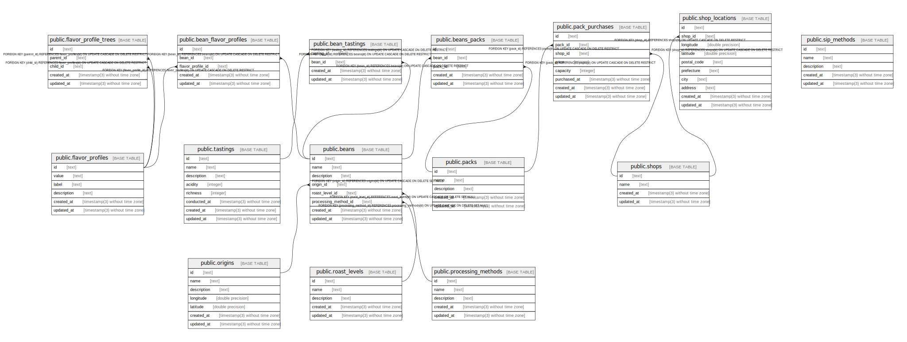

# cbd

## Tables

| Name                                                          | Columns | Comment                           | Type       |
| ------------------------------------------------------------- | ------- | --------------------------------- | ---------- |
| [public.packs](public.packs.md)                               | 5       | Coffee packs                      | BASE TABLE |
| [public.beans_packs](public.beans_packs.md)                   | 5       | Beans packs relationship          | BASE TABLE |
| [public.beans](public.beans.md)                               | 8       | Whole beans                       | BASE TABLE |
| [public.origins](public.origins.md)                           | 7       | Coffee origins                    | BASE TABLE |
| [public.roast_levels](public.roast_levels.md)                 | 5       | Coffee roast levels               | BASE TABLE |
| [public.processing_methods](public.processing_methods.md)     | 5       | Coffee processing methods         | BASE TABLE |
| [public.flavor_profiles](public.flavor_profiles.md)           | 6       | Coffee flavor profiles            | BASE TABLE |
| [public.flavor_profile_trees](public.flavor_profile_trees.md) | 5       | Coffee flavor profile trees       | BASE TABLE |
| [public.bean_flavor_profiles](public.bean_flavor_profiles.md) | 5       | Bean flavor profiles relationship | BASE TABLE |
| [public.tastings](public.tastings.md)                         | 8       | Coffee tasting                    | BASE TABLE |
| [public.bean_tastings](public.bean_tastings.md)               | 4       | Bean tastings relationship        | BASE TABLE |
| [public.shops](public.shops.md)                               | 4       | Coffee shops                      | BASE TABLE |
| [public.shop_locations](public.shop_locations.md)             | 10      | Coffee shop locations             | BASE TABLE |
| [public.pack_purchases](public.pack_purchases.md)             | 8       | Coffee pack purchases             | BASE TABLE |

## Relations

---

> Generated by [tbls](https://github.com/k1LoW/tbls)
