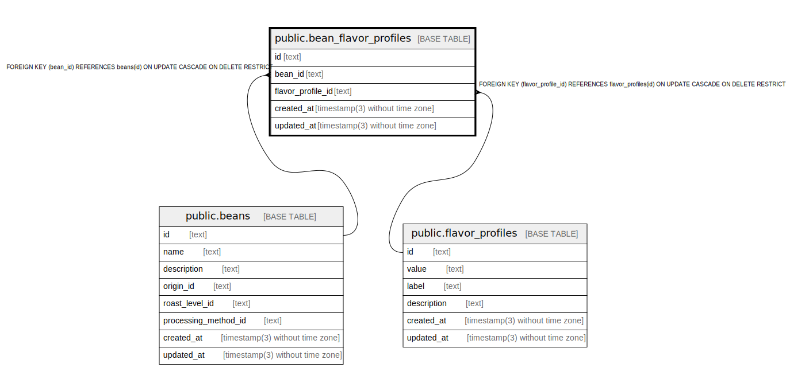

# public.bean_flavor_profiles

## Description

Bean flavor profiles relationship

## Columns

| Name              | Type                           | Default           | Nullable | Children | Parents                                             | Comment           |
| ----------------- | ------------------------------ | ----------------- | -------- | -------- | --------------------------------------------------- | ----------------- |
| id                | text                           |                   | false    |          |                                                     |                   |
| bean_id           | text                           |                   | false    |          | [public.beans](public.beans.md)                     | Bean ID           |
| flavor_profile_id | text                           |                   | false    |          | [public.flavor_profiles](public.flavor_profiles.md) | Flavor profile ID |
| created_at        | timestamp(3) without time zone | CURRENT_TIMESTAMP | false    |          |                                                     |                   |
| updated_at        | timestamp(3) without time zone |                   | false    |          |                                                     |                   |

## Constraints

| Name                                        | Type        | Definition                                                                                          |
| ------------------------------------------- | ----------- | --------------------------------------------------------------------------------------------------- |
| bean_flavor_profiles_bean_id_fkey           | FOREIGN KEY | FOREIGN KEY (bean_id) REFERENCES beans(id) ON UPDATE CASCADE ON DELETE RESTRICT                     |
| bean_flavor_profiles_flavor_profile_id_fkey | FOREIGN KEY | FOREIGN KEY (flavor_profile_id) REFERENCES flavor_profiles(id) ON UPDATE CASCADE ON DELETE RESTRICT |
| bean_flavor_profiles_pkey                   | PRIMARY KEY | PRIMARY KEY (id)                                                                                    |

## Indexes

| Name                             | Definition                                                                                                |
| -------------------------------- | --------------------------------------------------------------------------------------------------------- |
| bean_flavor_profiles_pkey        | CREATE UNIQUE INDEX bean_flavor_profiles_pkey ON public.bean_flavor_profiles USING btree (id)             |
| bean_flavor_profiles_bean_id_key | CREATE UNIQUE INDEX bean_flavor_profiles_bean_id_key ON public.bean_flavor_profiles USING btree (bean_id) |

## Relations

---

> Generated by [tbls](https://github.com/k1LoW/tbls)
