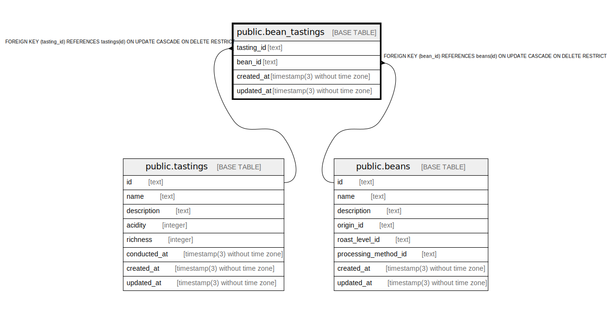

# public.bean_tastings

## Description

Bean tastings relationship

## Columns

| Name       | Type                           | Default           | Nullable | Children | Parents                               | Comment    |
| ---------- | ------------------------------ | ----------------- | -------- | -------- | ------------------------------------- | ---------- |
| tasting_id | text                           |                   | false    |          | [public.tastings](public.tastings.md) | Tasting ID |
| bean_id    | text                           |                   | false    |          | [public.beans](public.beans.md)       | Bean ID    |
| created_at | timestamp(3) without time zone | CURRENT_TIMESTAMP | false    |          |                                       |            |
| updated_at | timestamp(3) without time zone |                   | false    |          |                                       |            |

## Constraints

| Name                          | Type        | Definition                                                                            |
| ----------------------------- | ----------- | ------------------------------------------------------------------------------------- |
| bean_tastings_bean_id_fkey    | FOREIGN KEY | FOREIGN KEY (bean_id) REFERENCES beans(id) ON UPDATE CASCADE ON DELETE RESTRICT       |
| bean_tastings_tasting_id_fkey | FOREIGN KEY | FOREIGN KEY (tasting_id) REFERENCES tastings(id) ON UPDATE CASCADE ON DELETE RESTRICT |
| bean_tastings_pkey            | PRIMARY KEY | PRIMARY KEY (tasting_id)                                                              |

## Indexes

| Name                      | Definition                                                                                  |
| ------------------------- | ------------------------------------------------------------------------------------------- |
| bean_tastings_pkey        | CREATE UNIQUE INDEX bean_tastings_pkey ON public.bean_tastings USING btree (tasting_id)     |
| bean_tastings_bean_id_key | CREATE UNIQUE INDEX bean_tastings_bean_id_key ON public.bean_tastings USING btree (bean_id) |

## Relations

---

> Generated by [tbls](https://github.com/k1LoW/tbls)
