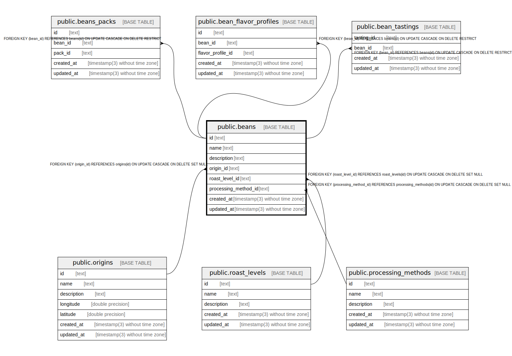

# public.beans

## Description

Whole beans

## Columns

| Name                 | Type                           | Default           | Nullable | Children                                                                                                      | Parents                                                   | Comment                |
| -------------------- | ------------------------------ | ----------------- | -------- | ------------------------------------------------------------------------------------------------------------- | --------------------------------------------------------- | ---------------------- |
| id                   | text                           |                   | false    | [public.bean_flavor_profiles](public.bean_flavor_profiles.md) [public.bean_tastings](public.bean_tastings.md) |                                                           | Whole bean ID          |
| name                 | text                           |                   | false    |                                                                                                               |                                                           | Whole bean name        |
| description          | text                           |                   | true     |                                                                                                               |                                                           | Whole bean description |
| origin_id            | text                           |                   | false    |                                                                                                               | [public.origins](public.origins.md)                       | Origin ID              |
| roast_level_id       | text                           |                   | false    |                                                                                                               | [public.roast_levels](public.roast_levels.md)             | Roast level ID         |
| processing_method_id | text                           |                   | false    |                                                                                                               | [public.processing_methods](public.processing_methods.md) | Processing method ID   |
| created_at           | timestamp(3) without time zone | CURRENT_TIMESTAMP | false    |                                                                                                               |                                                           |                        |
| updated_at           | timestamp(3) without time zone |                   | false    |                                                                                                               |                                                           |                        |

## Constraints

| Name                            | Type        | Definition                                                                                                |
| ------------------------------- | ----------- | --------------------------------------------------------------------------------------------------------- |
| beans_pkey                      | PRIMARY KEY | PRIMARY KEY (id)                                                                                          |
| beans_origin_id_fkey            | FOREIGN KEY | FOREIGN KEY (origin_id) REFERENCES origins(id) ON UPDATE CASCADE ON DELETE RESTRICT                       |
| beans_roast_level_id_fkey       | FOREIGN KEY | FOREIGN KEY (roast_level_id) REFERENCES roast_levels(id) ON UPDATE CASCADE ON DELETE RESTRICT             |
| beans_processing_method_id_fkey | FOREIGN KEY | FOREIGN KEY (processing_method_id) REFERENCES processing_methods(id) ON UPDATE CASCADE ON DELETE RESTRICT |

## Indexes

| Name       | Definition                                                      |
| ---------- | --------------------------------------------------------------- |
| beans_pkey | CREATE UNIQUE INDEX beans_pkey ON public.beans USING btree (id) |

## Relations

---

> Generated by [tbls](https://github.com/k1LoW/tbls)
