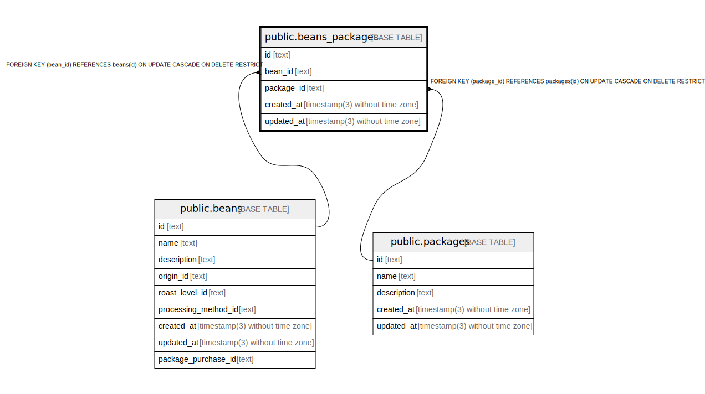

# public.beans_packages

## Description

## Columns

| Name       | Type                           | Default           | Nullable | Children | Parents                               | Comment |
| ---------- | ------------------------------ | ----------------- | -------- | -------- | ------------------------------------- | ------- |
| id         | text                           |                   | false    |          |                                       |         |
| bean_id    | text                           |                   | false    |          | [public.beans](public.beans.md)       |         |
| package_id | text                           |                   | false    |          | [public.packages](public.packages.md) |         |
| created_at | timestamp(3) without time zone | CURRENT_TIMESTAMP | false    |          |                                       |         |
| updated_at | timestamp(3) without time zone |                   | false    |          |                                       |         |

## Constraints

| Name                           | Type        | Definition                                                                            |
| ------------------------------ | ----------- | ------------------------------------------------------------------------------------- |
| beans_packages_package_id_fkey | FOREIGN KEY | FOREIGN KEY (package_id) REFERENCES packages(id) ON UPDATE CASCADE ON DELETE RESTRICT |
| beans_packages_pkey            | PRIMARY KEY | PRIMARY KEY (id)                                                                      |
| beans_packages_bean_id_fkey    | FOREIGN KEY | FOREIGN KEY (bean_id) REFERENCES beans(id) ON UPDATE CASCADE ON DELETE RESTRICT       |

## Indexes

| Name                | Definition                                                                        |
| ------------------- | --------------------------------------------------------------------------------- |
| beans_packages_pkey | CREATE UNIQUE INDEX beans_packages_pkey ON public.beans_packages USING btree (id) |

## Relations

---

> Generated by [tbls](https://github.com/k1LoW/tbls)
