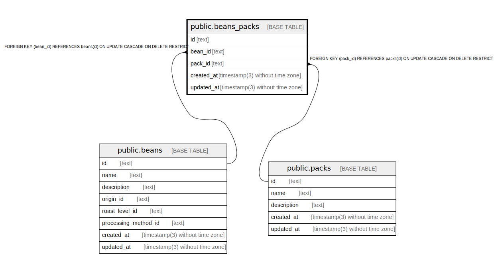

# public.beans_packs

## Description

Beans packs relationship

## Columns

| Name       | Type                           | Default           | Nullable | Children | Parents                         | Comment |
| ---------- | ------------------------------ | ----------------- | -------- | -------- | ------------------------------- | ------- |
| id         | text                           |                   | false    |          |                                 |         |
| bean_id    | text                           |                   | false    |          | [public.beans](public.beans.md) | Bean ID |
| pack_id    | text                           |                   | false    |          | [public.packs](public.packs.md) | Pack ID |
| created_at | timestamp(3) without time zone | CURRENT_TIMESTAMP | false    |          |                                 |         |
| updated_at | timestamp(3) without time zone |                   | false    |          |                                 |         |

## Constraints

| Name                     | Type        | Definition                                                                      |
| ------------------------ | ----------- | ------------------------------------------------------------------------------- |
| beans_packs_pack_id_fkey | FOREIGN KEY | FOREIGN KEY (pack_id) REFERENCES packs(id) ON UPDATE CASCADE ON DELETE RESTRICT |
| beans_packs_pkey         | PRIMARY KEY | PRIMARY KEY (id)                                                                |
| beans_packs_bean_id_fkey | FOREIGN KEY | FOREIGN KEY (bean_id) REFERENCES beans(id) ON UPDATE CASCADE ON DELETE RESTRICT |

## Indexes

| Name             | Definition                                                                  |
| ---------------- | --------------------------------------------------------------------------- |
| beans_packs_pkey | CREATE UNIQUE INDEX beans_packs_pkey ON public.beans_packs USING btree (id) |

## Relations

---

> Generated by [tbls](https://github.com/k1LoW/tbls)
