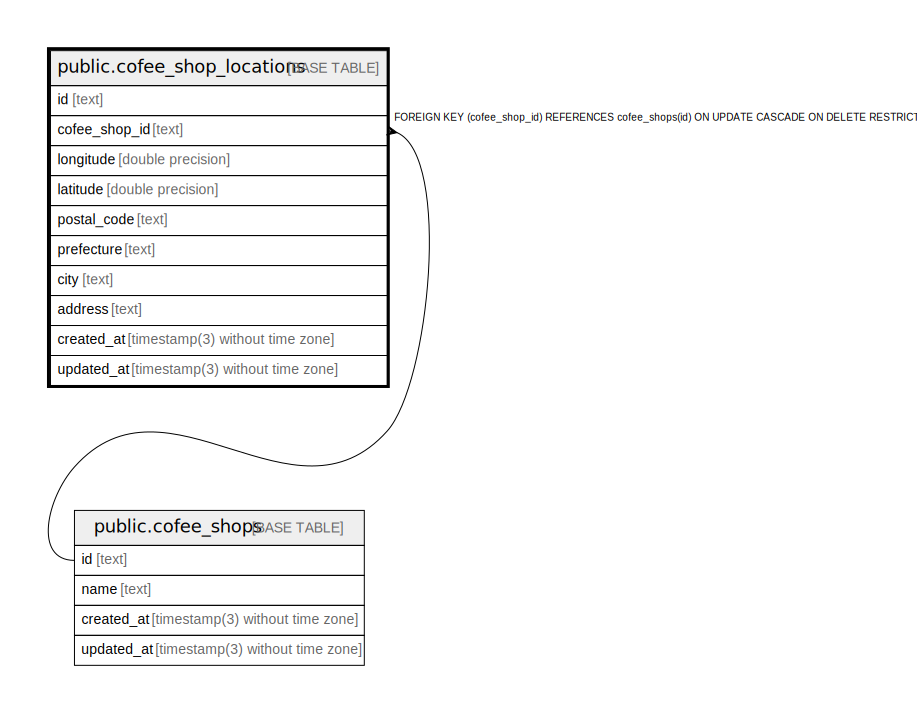

# public.cofee_shop_locations

## Description

## Columns

| Name          | Type                           | Default           | Nullable | Children | Parents                                     | Comment |
| ------------- | ------------------------------ | ----------------- | -------- | -------- | ------------------------------------------- | ------- |
| id            | text                           |                   | false    |          |                                             |         |
| cofee_shop_id | text                           |                   | false    |          | [public.cofee_shops](public.cofee_shops.md) |         |
| longitude     | double precision               |                   | true     |          |                                             |         |
| latitude      | double precision               |                   | true     |          |                                             |         |
| postal_code   | text                           |                   | true     |          |                                             |         |
| prefecture    | text                           |                   | true     |          |                                             |         |
| city          | text                           |                   | true     |          |                                             |         |
| address       | text                           |                   | true     |          |                                             |         |
| created_at    | timestamp(3) without time zone | CURRENT_TIMESTAMP | false    |          |                                             |         |
| updated_at    | timestamp(3) without time zone |                   | false    |          |                                             |         |

## Constraints

| Name                                    | Type        | Definition                                                                                  |
| --------------------------------------- | ----------- | ------------------------------------------------------------------------------------------- |
| cofee_shop_locations_cofee_shop_id_fkey | FOREIGN KEY | FOREIGN KEY (cofee_shop_id) REFERENCES cofee_shops(id) ON UPDATE CASCADE ON DELETE RESTRICT |
| cofee_shop_locations_pkey               | PRIMARY KEY | PRIMARY KEY (id)                                                                            |

## Indexes

| Name                                   | Definition                                                                                                            |
| -------------------------------------- | --------------------------------------------------------------------------------------------------------------------- |
| cofee_shop_locations_pkey              | CREATE UNIQUE INDEX cofee_shop_locations_pkey ON public.cofee_shop_locations USING btree (id)                         |
| cofee_shop_locations_cofee_shop_id_key | CREATE UNIQUE INDEX cofee_shop_locations_cofee_shop_id_key ON public.cofee_shop_locations USING btree (cofee_shop_id) |

## Relations

---

> Generated by [tbls](https://github.com/k1LoW/tbls)
