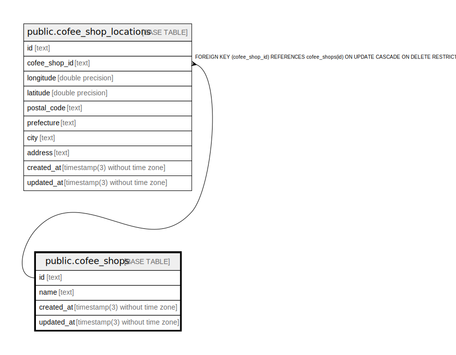

# public.cofee_shops

## Description

## Columns

| Name       | Type                           | Default           | Nullable | Children                                                      | Parents | Comment |
| ---------- | ------------------------------ | ----------------- | -------- | ------------------------------------------------------------- | ------- | ------- |
| id         | text                           |                   | false    | [public.cofee_shop_locations](public.cofee_shop_locations.md) |         |         |
| name       | text                           |                   | false    |                                                               |         |         |
| created_at | timestamp(3) without time zone | CURRENT_TIMESTAMP | false    |                                                               |         |         |
| updated_at | timestamp(3) without time zone |                   | false    |                                                               |         |         |

## Constraints

| Name             | Type        | Definition       |
| ---------------- | ----------- | ---------------- |
| cofee_shops_pkey | PRIMARY KEY | PRIMARY KEY (id) |

## Indexes

| Name                 | Definition                                                                        |
| -------------------- | --------------------------------------------------------------------------------- |
| cofee_shops_pkey     | CREATE UNIQUE INDEX cofee_shops_pkey ON public.cofee_shops USING btree (id)       |
| cofee_shops_name_key | CREATE UNIQUE INDEX cofee_shops_name_key ON public.cofee_shops USING btree (name) |

## Relations

---

> Generated by [tbls](https://github.com/k1LoW/tbls)
