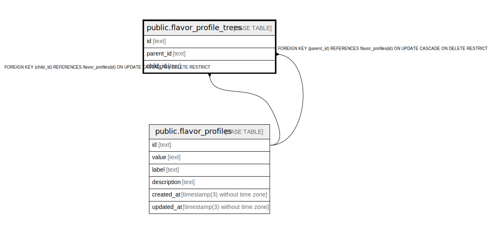

# public.flavor_profile_trees

## Description

Coffee flavor profile trees

## Columns

| Name       | Type                           | Default           | Nullable | Children | Parents                                             | Comment                              |
| ---------- | ------------------------------ | ----------------- | -------- | -------- | --------------------------------------------------- | ------------------------------------ |
| id         | text                           |                   | false    |          |                                                     | Coffee flavor profile tree ID        |
| parent_id  | text                           |                   | false    |          | [public.flavor_profiles](public.flavor_profiles.md) | Coffee flavor profile tree parent ID |
| child_id   | text                           |                   | false    |          | [public.flavor_profiles](public.flavor_profiles.md) | Coffee flavor profile tree child ID  |
| created_at | timestamp(3) without time zone | CURRENT_TIMESTAMP | false    |          |                                                     |                                      |
| updated_at | timestamp(3) without time zone |                   | false    |          |                                                     |                                      |

## Constraints

| Name                                | Type        | Definition                                                                                  |
| ----------------------------------- | ----------- | ------------------------------------------------------------------------------------------- |
| flavor_profile_trees_child_id_fkey  | FOREIGN KEY | FOREIGN KEY (child_id) REFERENCES flavor_profiles(id) ON UPDATE CASCADE ON DELETE RESTRICT  |
| flavor_profile_trees_parent_id_fkey | FOREIGN KEY | FOREIGN KEY (parent_id) REFERENCES flavor_profiles(id) ON UPDATE CASCADE ON DELETE RESTRICT |
| flavor_profile_trees_pkey           | PRIMARY KEY | PRIMARY KEY (id)                                                                            |

## Indexes

| Name                      | Definition                                                                                    |
| ------------------------- | --------------------------------------------------------------------------------------------- |
| flavor_profile_trees_pkey | CREATE UNIQUE INDEX flavor_profile_trees_pkey ON public.flavor_profile_trees USING btree (id) |

## Relations

---

> Generated by [tbls](https://github.com/k1LoW/tbls)
