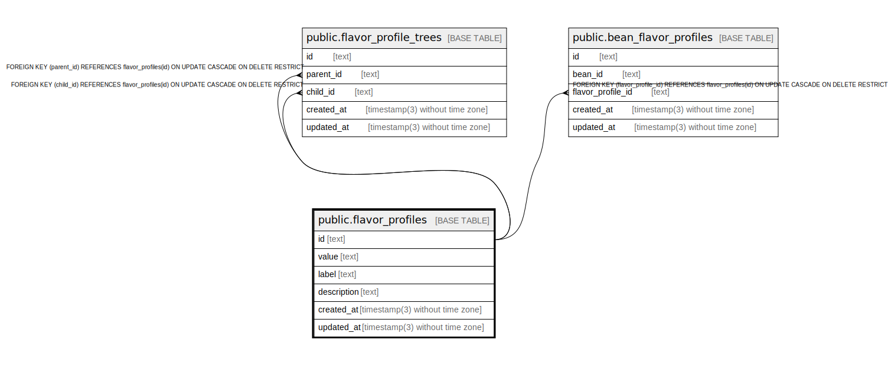

# public.flavor_profiles

## Description

Coffee flavor profiles

## Columns

| Name        | Type                           | Default           | Nullable | Children                                                                                                                    | Parents | Comment                           |
| ----------- | ------------------------------ | ----------------- | -------- | --------------------------------------------------------------------------------------------------------------------------- | ------- | --------------------------------- |
| id          | text                           |                   | false    | [public.flavor_profile_trees](public.flavor_profile_trees.md) [public.bean_flavor_profiles](public.bean_flavor_profiles.md) |         | Coffee flavor profile ID          |
| value       | text                           |                   | false    |                                                                                                                             |         | Coffee flavor profile value       |
| label       | text                           |                   | false    |                                                                                                                             |         | Coffee flavor profile label       |
| description | text                           |                   | true     |                                                                                                                             |         | Coffee flavor profile description |
| created_at  | timestamp(3) without time zone | CURRENT_TIMESTAMP | false    |                                                                                                                             |         |                                   |
| updated_at  | timestamp(3) without time zone |                   | false    |                                                                                                                             |         |                                   |

## Constraints

| Name                 | Type        | Definition       |
| -------------------- | ----------- | ---------------- |
| flavor_profiles_pkey | PRIMARY KEY | PRIMARY KEY (id) |

## Indexes

| Name                      | Definition                                                                                  |
| ------------------------- | ------------------------------------------------------------------------------------------- |
| flavor_profiles_pkey      | CREATE UNIQUE INDEX flavor_profiles_pkey ON public.flavor_profiles USING btree (id)         |
| flavor_profiles_value_key | CREATE UNIQUE INDEX flavor_profiles_value_key ON public.flavor_profiles USING btree (value) |

## Relations

---

> Generated by [tbls](https://github.com/k1LoW/tbls)
