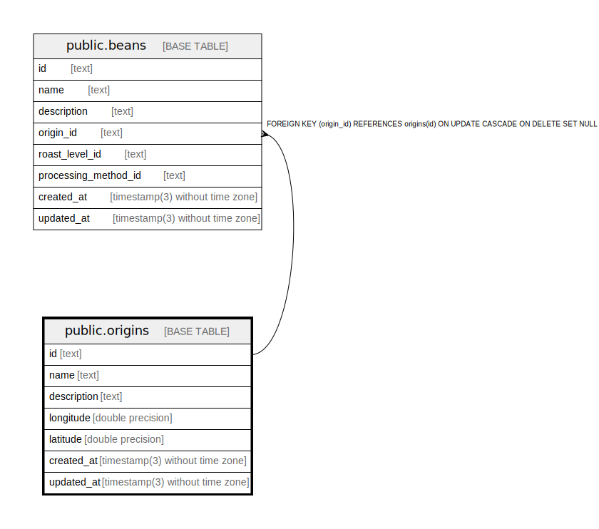

# public.origins

## Description

Coffee origins

## Columns

| Name        | Type                           | Default           | Nullable | Children                        | Parents | Comment                   |
| ----------- | ------------------------------ | ----------------- | -------- | ------------------------------- | ------- | ------------------------- |
| id          | text                           |                   | false    | [public.beans](public.beans.md) |         | Coffee origin ID          |
| name        | text                           |                   | false    |                                 |         | Coffee origin name        |
| description | text                           |                   | true     |                                 |         | Coffee origin description |
| longitude   | double precision               |                   | true     |                                 |         | Coffee origin longitude   |
| latitude    | double precision               |                   | true     |                                 |         | Coffee origin latitude    |
| created_at  | timestamp(3) without time zone | CURRENT_TIMESTAMP | false    |                                 |         |                           |
| updated_at  | timestamp(3) without time zone |                   | false    |                                 |         |                           |

## Constraints

| Name         | Type        | Definition       |
| ------------ | ----------- | ---------------- |
| origins_pkey | PRIMARY KEY | PRIMARY KEY (id) |

## Indexes

| Name             | Definition                                                                |
| ---------------- | ------------------------------------------------------------------------- |
| origins_pkey     | CREATE UNIQUE INDEX origins_pkey ON public.origins USING btree (id)       |
| origins_name_key | CREATE UNIQUE INDEX origins_name_key ON public.origins USING btree (name) |

## Relations

---

> Generated by [tbls](https://github.com/k1LoW/tbls)
