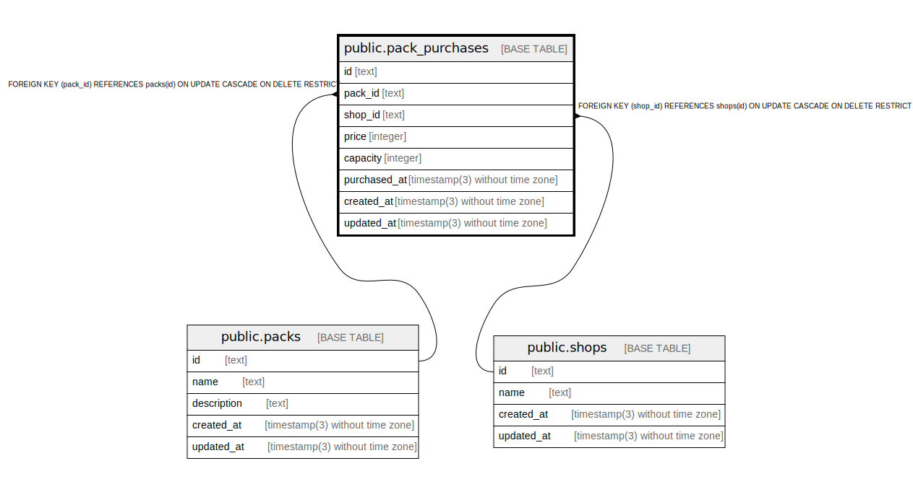

# public.pack_purchases

## Description

Coffee pack purchases

## Columns

| Name         | Type                           | Default           | Nullable | Children | Parents                         | Comment                       |
| ------------ | ------------------------------ | ----------------- | -------- | -------- | ------------------------------- | ----------------------------- |
| id           | text                           |                   | false    |          |                                 | Coffee pack purchase ID       |
| pack_id      | text                           |                   | false    |          | [public.packs](public.packs.md) | Coffee pack ID                |
| shop_id      | text                           |                   | false    |          | [public.shops](public.shops.md) | Coffee shop ID                |
| price        | integer                        |                   | false    |          |                                 | Coffee pack purchase price    |
| capacity     | integer                        |                   | false    |          |                                 | Coffee pack purchase capacity |
| purchased_at | timestamp(3) without time zone |                   | false    |          |                                 | Coffee pack purchased at      |
| created_at   | timestamp(3) without time zone | CURRENT_TIMESTAMP | false    |          |                                 |                               |
| updated_at   | timestamp(3) without time zone |                   | false    |          |                                 |                               |

## Constraints

| Name                        | Type        | Definition                                                                      |
| --------------------------- | ----------- | ------------------------------------------------------------------------------- |
| pack_purchases_pack_id_fkey | FOREIGN KEY | FOREIGN KEY (pack_id) REFERENCES packs(id) ON UPDATE CASCADE ON DELETE RESTRICT |
| pack_purchases_shop_id_fkey | FOREIGN KEY | FOREIGN KEY (shop_id) REFERENCES shops(id) ON UPDATE CASCADE ON DELETE RESTRICT |
| pack_purchases_pkey         | PRIMARY KEY | PRIMARY KEY (id)                                                                |

## Indexes

| Name                       | Definition                                                                                    |
| -------------------------- | --------------------------------------------------------------------------------------------- |
| pack_purchases_pkey        | CREATE UNIQUE INDEX pack_purchases_pkey ON public.pack_purchases USING btree (id)             |
| pack_purchases_pack_id_key | CREATE UNIQUE INDEX pack_purchases_pack_id_key ON public.pack_purchases USING btree (pack_id) |
| pack_purchases_shop_id_key | CREATE UNIQUE INDEX pack_purchases_shop_id_key ON public.pack_purchases USING btree (shop_id) |

## Relations

---

> Generated by [tbls](https://github.com/k1LoW/tbls)
