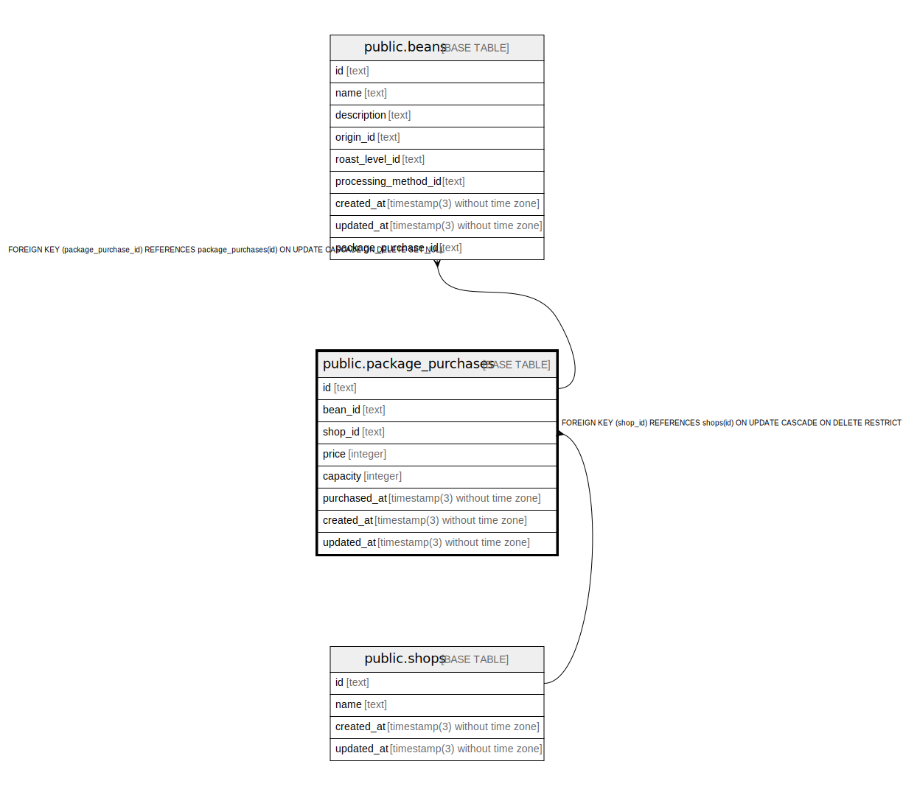

# public.package_purchases

## Description

## Columns

| Name         | Type                           | Default           | Nullable | Children                        | Parents                         | Comment |
| ------------ | ------------------------------ | ----------------- | -------- | ------------------------------- | ------------------------------- | ------- |
| id           | text                           |                   | false    | [public.beans](public.beans.md) |                                 |         |
| bean_id      | text                           |                   | false    |                                 |                                 |         |
| shop_id      | text                           |                   | false    |                                 | [public.shops](public.shops.md) |         |
| price        | integer                        |                   | false    |                                 |                                 |         |
| capacity     | integer                        |                   | false    |                                 |                                 |         |
| purchased_at | timestamp(3) without time zone |                   | false    |                                 |                                 |         |
| created_at   | timestamp(3) without time zone | CURRENT_TIMESTAMP | false    |                                 |                                 |         |
| updated_at   | timestamp(3) without time zone |                   | false    |                                 |                                 |         |

## Constraints

| Name                           | Type        | Definition                                                                      |
| ------------------------------ | ----------- | ------------------------------------------------------------------------------- |
| package_purchases_shop_id_fkey | FOREIGN KEY | FOREIGN KEY (shop_id) REFERENCES shops(id) ON UPDATE CASCADE ON DELETE RESTRICT |
| package_purchases_pkey         | PRIMARY KEY | PRIMARY KEY (id)                                                                |

## Indexes

| Name                          | Definition                                                                                          |
| ----------------------------- | --------------------------------------------------------------------------------------------------- |
| package_purchases_pkey        | CREATE UNIQUE INDEX package_purchases_pkey ON public.package_purchases USING btree (id)             |
| package_purchases_shop_id_key | CREATE UNIQUE INDEX package_purchases_shop_id_key ON public.package_purchases USING btree (shop_id) |

## Relations

---

> Generated by [tbls](https://github.com/k1LoW/tbls)
