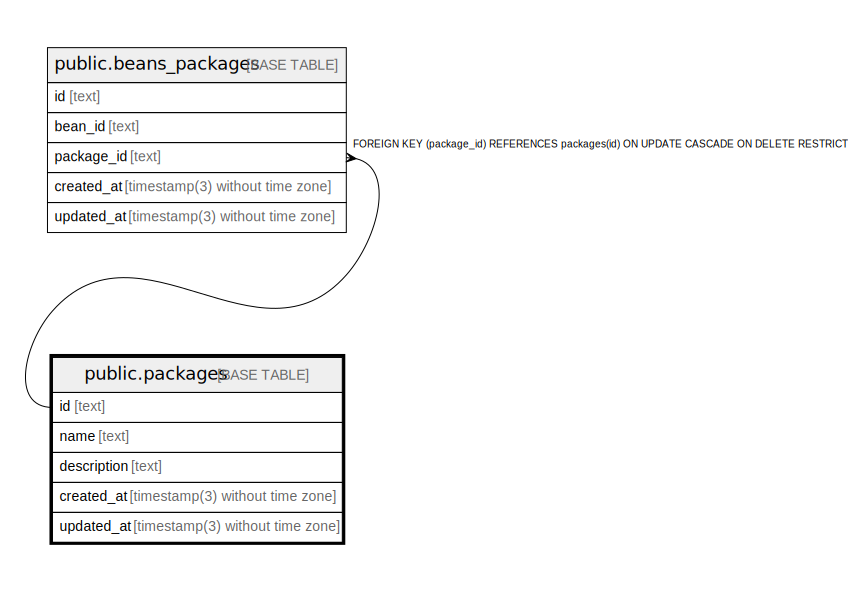

# public.packages

## Description

## Columns

| Name        | Type                           | Default           | Nullable | Children                                          | Parents | Comment |
| ----------- | ------------------------------ | ----------------- | -------- | ------------------------------------------------- | ------- | ------- |
| id          | text                           |                   | false    | [public.beans_packages](public.beans_packages.md) |         |         |
| name        | text                           |                   | false    |                                                   |         |         |
| description | text                           |                   | true     |                                                   |         |         |
| created_at  | timestamp(3) without time zone | CURRENT_TIMESTAMP | false    |                                                   |         |         |
| updated_at  | timestamp(3) without time zone |                   | false    |                                                   |         |         |

## Constraints

| Name          | Type        | Definition       |
| ------------- | ----------- | ---------------- |
| packages_pkey | PRIMARY KEY | PRIMARY KEY (id) |

## Indexes

| Name              | Definition                                                                  |
| ----------------- | --------------------------------------------------------------------------- |
| packages_pkey     | CREATE UNIQUE INDEX packages_pkey ON public.packages USING btree (id)       |
| packages_name_key | CREATE UNIQUE INDEX packages_name_key ON public.packages USING btree (name) |

## Relations

---

> Generated by [tbls](https://github.com/k1LoW/tbls)
