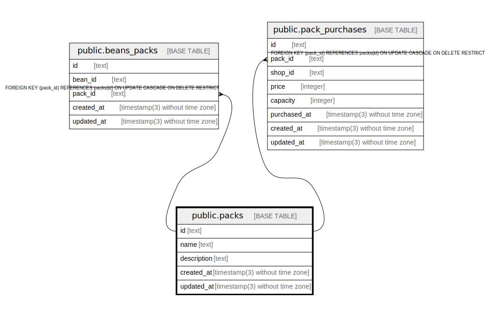

# public.packs

## Description

Coffee packs

## Columns

| Name        | Type                           | Default           | Nullable | Children                                                                                      | Parents | Comment                 |
| ----------- | ------------------------------ | ----------------- | -------- | --------------------------------------------------------------------------------------------- | ------- | ----------------------- |
| id          | text                           |                   | false    | [public.beans_packs](public.beans_packs.md) [public.pack_purchases](public.pack_purchases.md) |         | Coffee pack ID          |
| name        | text                           |                   | false    |                                                                                               |         | Coffee pack name        |
| description | text                           |                   | true     |                                                                                               |         | Coffee pack description |
| created_at  | timestamp(3) without time zone | CURRENT_TIMESTAMP | false    |                                                                                               |         |                         |
| updated_at  | timestamp(3) without time zone |                   | false    |                                                                                               |         |                         |

## Constraints

| Name       | Type        | Definition       |
| ---------- | ----------- | ---------------- |
| packs_pkey | PRIMARY KEY | PRIMARY KEY (id) |

## Indexes

| Name           | Definition                                                            |
| -------------- | --------------------------------------------------------------------- |
| packs_pkey     | CREATE UNIQUE INDEX packs_pkey ON public.packs USING btree (id)       |
| packs_name_key | CREATE UNIQUE INDEX packs_name_key ON public.packs USING btree (name) |

## Relations

---

> Generated by [tbls](https://github.com/k1LoW/tbls)
