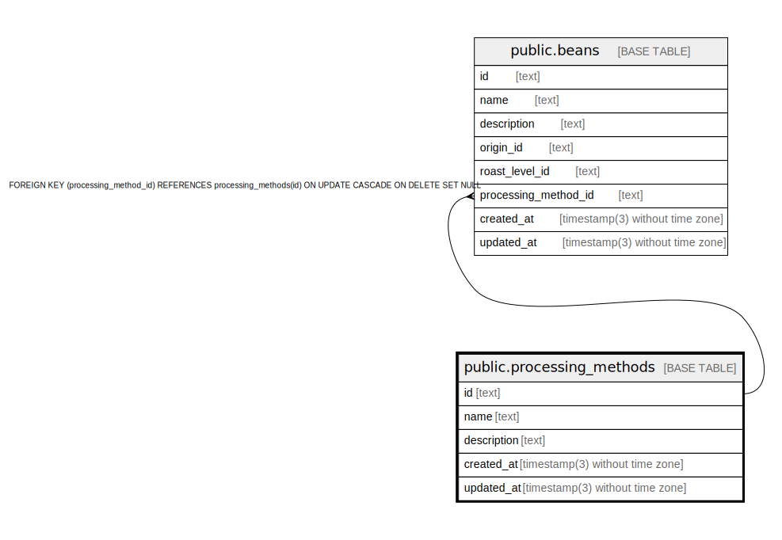

# public.processing_methods

## Description

Coffee processing methods

## Columns

| Name        | Type                           | Default           | Nullable | Children                        | Parents | Comment                              |
| ----------- | ------------------------------ | ----------------- | -------- | ------------------------------- | ------- | ------------------------------------ |
| id          | text                           |                   | false    | [public.beans](public.beans.md) |         | Coffee processing method ID          |
| name        | text                           |                   | false    |                                 |         | Coffee processing method name        |
| description | text                           |                   | false    |                                 |         | Coffee processing method description |
| created_at  | timestamp(3) without time zone | CURRENT_TIMESTAMP | false    |                                 |         |                                      |
| updated_at  | timestamp(3) without time zone |                   | false    |                                 |         |                                      |

## Constraints

| Name                    | Type        | Definition       |
| ----------------------- | ----------- | ---------------- |
| processing_methods_pkey | PRIMARY KEY | PRIMARY KEY (id) |

## Indexes

| Name                        | Definition                                                                                      |
| --------------------------- | ----------------------------------------------------------------------------------------------- |
| processing_methods_pkey     | CREATE UNIQUE INDEX processing_methods_pkey ON public.processing_methods USING btree (id)       |
| processing_methods_name_key | CREATE UNIQUE INDEX processing_methods_name_key ON public.processing_methods USING btree (name) |

## Relations

---

> Generated by [tbls](https://github.com/k1LoW/tbls)
