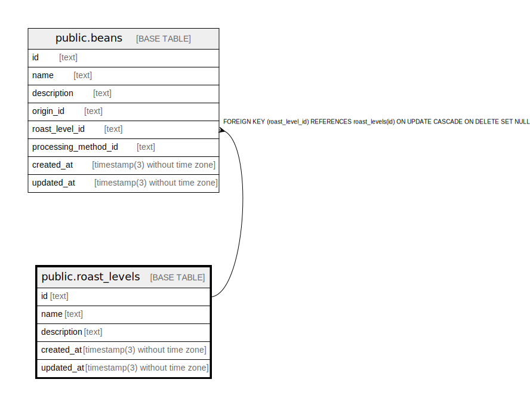

# public.roast_levels

## Description

Coffee roast levels

## Columns

| Name        | Type                           | Default           | Nullable | Children                        | Parents | Comment                        |
| ----------- | ------------------------------ | ----------------- | -------- | ------------------------------- | ------- | ------------------------------ |
| id          | text                           |                   | false    | [public.beans](public.beans.md) |         | Coffee roast level ID          |
| name        | text                           |                   | false    |                                 |         | Coffee roast level name        |
| description | text                           |                   | true     |                                 |         | Coffee roast level description |
| created_at  | timestamp(3) without time zone | CURRENT_TIMESTAMP | false    |                                 |         |                                |
| updated_at  | timestamp(3) without time zone |                   | false    |                                 |         |                                |

## Constraints

| Name              | Type        | Definition       |
| ----------------- | ----------- | ---------------- |
| roast_levels_pkey | PRIMARY KEY | PRIMARY KEY (id) |

## Indexes

| Name                  | Definition                                                                          |
| --------------------- | ----------------------------------------------------------------------------------- |
| roast_levels_pkey     | CREATE UNIQUE INDEX roast_levels_pkey ON public.roast_levels USING btree (id)       |
| roast_levels_name_key | CREATE UNIQUE INDEX roast_levels_name_key ON public.roast_levels USING btree (name) |

## Relations

---

> Generated by [tbls](https://github.com/k1LoW/tbls)
