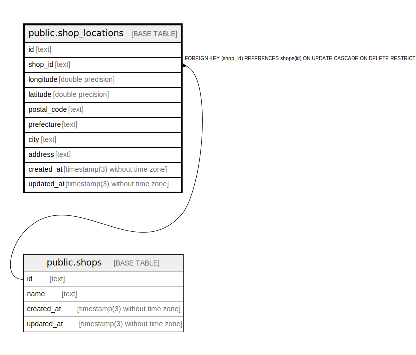

# public.shop_locations

## Description

## Columns

| Name        | Type                           | Default           | Nullable | Children | Parents                         | Comment |
| ----------- | ------------------------------ | ----------------- | -------- | -------- | ------------------------------- | ------- |
| id          | text                           |                   | false    |          |                                 |         |
| shop_id     | text                           |                   | false    |          | [public.shops](public.shops.md) |         |
| longitude   | double precision               |                   | true     |          |                                 |         |
| latitude    | double precision               |                   | true     |          |                                 |         |
| postal_code | text                           |                   | true     |          |                                 |         |
| prefecture  | text                           |                   | true     |          |                                 |         |
| city        | text                           |                   | true     |          |                                 |         |
| address     | text                           |                   | true     |          |                                 |         |
| created_at  | timestamp(3) without time zone | CURRENT_TIMESTAMP | false    |          |                                 |         |
| updated_at  | timestamp(3) without time zone |                   | false    |          |                                 |         |

## Constraints

| Name                        | Type        | Definition                                                                      |
| --------------------------- | ----------- | ------------------------------------------------------------------------------- |
| shop_locations_shop_id_fkey | FOREIGN KEY | FOREIGN KEY (shop_id) REFERENCES shops(id) ON UPDATE CASCADE ON DELETE RESTRICT |
| shop_locations_pkey         | PRIMARY KEY | PRIMARY KEY (id)                                                                |

## Indexes

| Name                       | Definition                                                                                    |
| -------------------------- | --------------------------------------------------------------------------------------------- |
| shop_locations_pkey        | CREATE UNIQUE INDEX shop_locations_pkey ON public.shop_locations USING btree (id)             |
| shop_locations_shop_id_key | CREATE UNIQUE INDEX shop_locations_shop_id_key ON public.shop_locations USING btree (shop_id) |

## Relations

---

> Generated by [tbls](https://github.com/k1LoW/tbls)
