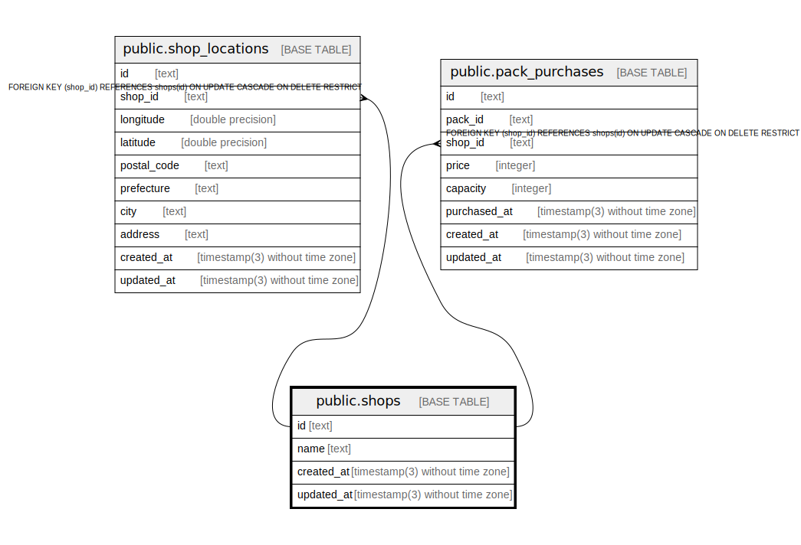

# public.shops

## Description

Coffee shops

## Columns

| Name       | Type                           | Default           | Nullable | Children                                                                                            | Parents | Comment          |
| ---------- | ------------------------------ | ----------------- | -------- | --------------------------------------------------------------------------------------------------- | ------- | ---------------- |
| id         | text                           |                   | false    | [public.shop_locations](public.shop_locations.md) [public.pack_purchases](public.pack_purchases.md) |         | Coffee shop ID   |
| name       | text                           |                   | false    |                                                                                                     |         | Coffee shop name |
| created_at | timestamp(3) without time zone | CURRENT_TIMESTAMP | false    |                                                                                                     |         |                  |
| updated_at | timestamp(3) without time zone |                   | false    |                                                                                                     |         |                  |

## Constraints

| Name       | Type        | Definition       |
| ---------- | ----------- | ---------------- |
| shops_pkey | PRIMARY KEY | PRIMARY KEY (id) |

## Indexes

| Name           | Definition                                                            |
| -------------- | --------------------------------------------------------------------- |
| shops_pkey     | CREATE UNIQUE INDEX shops_pkey ON public.shops USING btree (id)       |
| shops_name_key | CREATE UNIQUE INDEX shops_name_key ON public.shops USING btree (name) |

## Relations

---

> Generated by [tbls](https://github.com/k1LoW/tbls)
