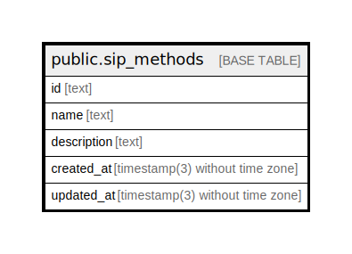

# public.sip_methods

## Description

Coffee sipping methods

## Columns

| Name        | Type                           | Default           | Nullable | Children | Parents | Comment                       |
| ----------- | ------------------------------ | ----------------- | -------- | -------- | ------- | ----------------------------- |
| id          | text                           |                   | false    |          |         | Coffee sip method ID          |
| name        | text                           |                   | false    |          |         | Coffee sip method name        |
| description | text                           |                   | true     |          |         | Coffee sip method description |
| created_at  | timestamp(3) without time zone | CURRENT_TIMESTAMP | false    |          |         |                               |
| updated_at  | timestamp(3) without time zone |                   | false    |          |         |                               |

## Constraints

| Name             | Type        | Definition       |
| ---------------- | ----------- | ---------------- |
| sip_methods_pkey | PRIMARY KEY | PRIMARY KEY (id) |

## Indexes

| Name                 | Definition                                                                        |
| -------------------- | --------------------------------------------------------------------------------- |
| sip_methods_pkey     | CREATE UNIQUE INDEX sip_methods_pkey ON public.sip_methods USING btree (id)       |
| sip_methods_name_key | CREATE UNIQUE INDEX sip_methods_name_key ON public.sip_methods USING btree (name) |

## Relations

---

> Generated by [tbls](https://github.com/k1LoW/tbls)
