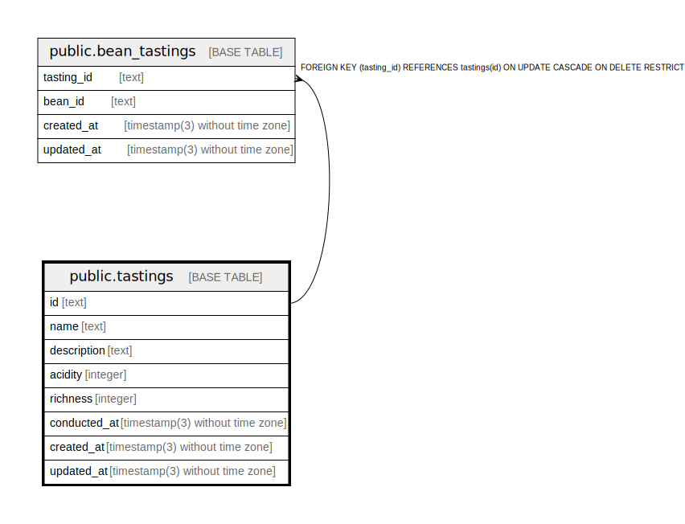

# public.tastings

## Description

Coffee tasting

## Columns

| Name         | Type                           | Default           | Nullable | Children                                        | Parents | Comment                     |
| ------------ | ------------------------------ | ----------------- | -------- | ----------------------------------------------- | ------- | --------------------------- |
| id           | text                           |                   | false    | [public.bean_tastings](public.bean_tastings.md) |         | Coffee tasting ID           |
| name         | text                           |                   | false    |                                                 |         | Coffee tasting name         |
| description  | text                           |                   | false    |                                                 |         | Coffee tasting description  |
| acidity      | integer                        |                   | false    |                                                 |         | Coffee tasting acidity      |
| richness     | integer                        |                   | false    |                                                 |         | Coffee tasting richness     |
| conducted_at | timestamp(3) without time zone |                   | false    |                                                 |         | Coffee tasting conducted at |
| created_at   | timestamp(3) without time zone | CURRENT_TIMESTAMP | false    |                                                 |         |                             |
| updated_at   | timestamp(3) without time zone |                   | false    |                                                 |         |                             |

## Constraints

| Name          | Type        | Definition       |
| ------------- | ----------- | ---------------- |
| tastings_pkey | PRIMARY KEY | PRIMARY KEY (id) |

## Indexes

| Name              | Definition                                                                  |
| ----------------- | --------------------------------------------------------------------------- |
| tastings_pkey     | CREATE UNIQUE INDEX tastings_pkey ON public.tastings USING btree (id)       |
| tastings_name_key | CREATE UNIQUE INDEX tastings_name_key ON public.tastings USING btree (name) |

## Relations

---

> Generated by [tbls](https://github.com/k1LoW/tbls)
